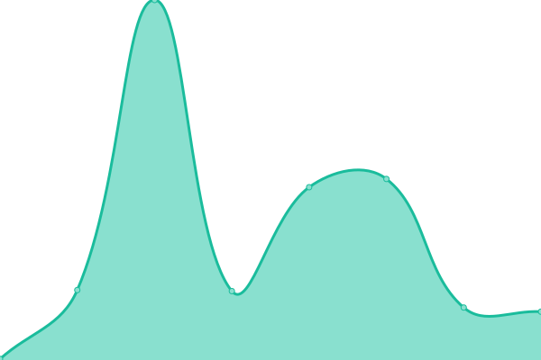
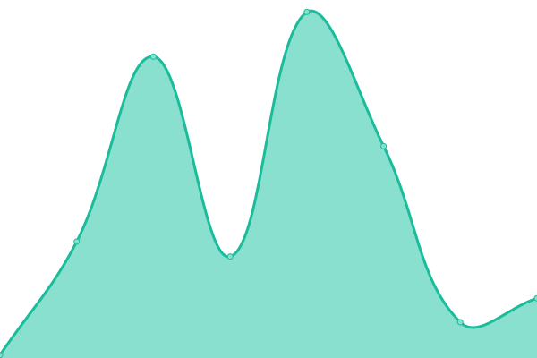

**Author: https://github.com/upptime/upptime**

### Current Status

<!--start: status pages-->
<!-- This summary is generated by Upptime (https://github.com/upptime/upptime) -->
<!-- Do not edit this manually, your changes will be overwritten -->
<!-- prettier-ignore -->
| URL | Status | History | Response Time | Uptime |
| --- | ------ | ------- | ------------- | ------ |
|  [331221.xyz](https://331221.xyz) | 🟩 Up | [331221-xyz.yml](https://github.com/ntrezowan/uptime/commits/HEAD/history/331221-xyz.yml) | 

 161ms
     
 | 

<a href="https://ntrezowan.github.io/uptime/history/331221-xyz">100.00%</a>
    

|  [ntrezowan.github.io](https://ntrezowan.github.io) | 🟩 Up | [ntrezowan-github-io.yml](https://github.com/ntrezowan/uptime/commits/HEAD/history/ntrezowan-github-io.yml) | 

 84ms
     
 | 

<a href="https://ntrezowan.github.io/uptime/history/ntrezowan-github-io">100.00%</a>
    

|  [ntrezowan.github.io/blog](https://ntrezowan.github.io/blog) | 🟩 Up | [ntrezowan-github-io-blog.yml](https://github.com/ntrezowan/uptime/commits/HEAD/history/ntrezowan-github-io-blog.yml) | 

 72ms
     
 | 

<a href="https://ntrezowan.github.io/uptime/history/ntrezowan-github-io-blog">100.00%</a>
    

<!--end: status pages-->
